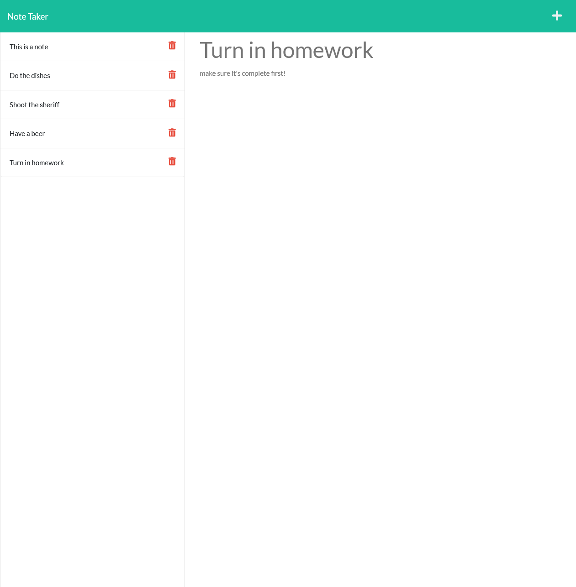

# Note Taker Starter Code

The aim of this project was to write and save notes in order to organize my thoughts and keep track of tasks I need to complete.

## Table of Contents
[Technologies Used](#technologies-used)  
[Installation](#installation)  
[Usage](#use)  
[Testing](#tests)  
[Media](#media)  
[Questions](#questions)  

## Technologies Used
* Express.js
* JavaScript
* HTML

with a focus on routing and Heroku

---

## Installation
Navigate to the root directory in the terminal and initialize the project with **npm install** to install all the proper node module dependencies

---

## Use
Navigate to the root directory in the terminal and type **node server.js** to run the project.
Then go to http://localhost:3001/ in your browser

---

## Tests
There are no official tests for this project

---

## Media

The following link is to this project's github repository
https://github.com/p-fassbender/note-taker

The following link is to this project's live website
https://mysterious-stream-53443.herokuapp.com/

---

## Questions
Any questions feel free to contact me via [my github](https://github.com/p-fassbender) or by sending me an email at fassbenderp0551@gmail.com.

---

## USER STORY
AS A small business owner
I WANT to be able to write and save notes
SO THAT I can organize my thoughts and keep track of tasks I need to complete

## ACCEPTANCE CRITERIA
* GIVEN a note-taking application
* WHEN I open the Note Taker
THEN I am presented with a landing page with a link to a notes page
* WHEN I click on the link to the notes page
THEN I am presented with a page with existing notes listed in the left-hand column, plus empty fields to enter a new note title and the note’s text in the right-hand column
* WHEN I enter a new note title and the note’s text
THEN a Save icon appears in the navigation at the top of the page
* WHEN I click on the Save icon
THEN the new note I have entered is saved and appears in the left-hand column with the other existing notes
* WHEN I click on an existing note in the list in the left-hand column
THEN that note appears in the right-hand column
* WHEN I click on the Write icon in the navigation at the top of the page
THEN I am presented with empty fields to enter a new note title and the note’s text in the right-hand column